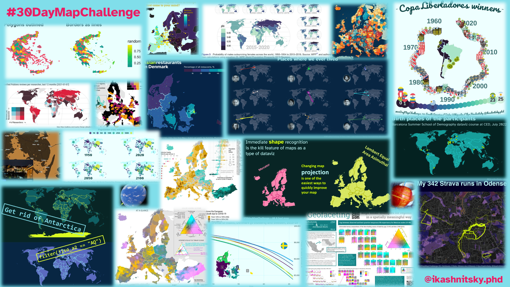

# My participation in \#30DayMapChallenge, November 2023

### Have a look at the [blog post](https://ikashnitsky.phd/2023/30-dmc/) that lists all contributions.

This repository contains code for the newly created visuals specifically
for the challenge.

**2023-11-06 \| polygons**  
[bsky](https://bsky.app/profile/ikashnitsky.phd/post/3kdjejp7ipi2u) \|
[fosstodon](https://fosstodon.org/@ikashnitsky/111405431300734214) \|
[code](https://github.com/ikashnitsky/30DayMapChallenge/blob/main/src/06-asian-restaurants.R)

**2023-11-08 \| Africa**  
[bsky](https://bsky.app/profile/ikashnitsky.phd/post/3kdocjzuvhq2e) \|
[fosstodon](https://fosstodon.org/@ikashnitsky/111405472725576212) \|
[code](https://github.com/ikashnitsky/30DayMapChallenge/blob/77d444be79c5170c83b2b6049847df7b5ec04536/src/08-africa-wpp.R)

**2023-11-12 \| South America**  
[bsky](https://bsky.app/profile/ikashnitsky.phd/post/3keafyo6ga422) \|
[fosstodon](https://fosstodon.org/@ikashnitsky/111415413730412646) \|
[code](https://github.com/ikashnitsky/30DayMapChallenge/blob/main/src/12-south-america-copa.R)

**2023-11-17 \| flow**  
[bsky](https://bsky.app/profile/ikashnitsky.phd/post/3kefic276eg2p) \|
[fosstodon](https://fosstodon.org/@ikashnitsky/111617087998805744) \|
[code](https://github.com/ikashnitsky/30DayMapChallenge/blob/main/src/17-flow-places-lived.R)

**2023-11-25 \| Antarctica**  
[bsky](https://bsky.app/profile/ikashnitsky.phd/post/3kezt7zaify26) \|
[fosstodon](https://fosstodon.org/@ikashnitsky/111617105804689802) \|
[code](https://github.com/ikashnitsky/30DayMapChallenge/blob/main/src/25-antarctica.R)

